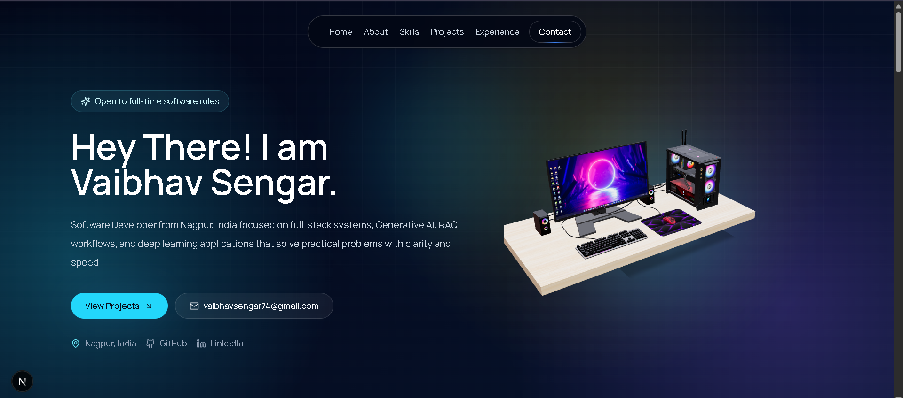

<div align="center">

# 👋 Vaibhav Sengar

### Full-Stack Developer · Generative AI Builder

*Engineering discipline meets AI-builder curiosity.*

[](https://nextjs.org/)
[](https://react.dev/)
[](https://www.typescriptlang.org/)
[](https://tailwindcss.com/)
[](https://www.framer.com/motion/)

**[🌐 Live Site](#) · [📧 Email](mailto:vaibhavsengar74@gmail.com) · [💼 LinkedIn](https://www.linkedin.com/in/thevaibhavsengar/)**

</div>

---

## ✨ Overview

This is the source for my personal portfolio — a fast, animated, single-page site built to showcase how I think and build: clean system architecture, thoughtful UI, and AI systems that go beyond the demo stage.

I'm a Computer Science graduate with a full-stack foundation and a growing specialization in **Generative AI** and **deep learning systems**. My work spans medical image analysis, Retrieval-Augmented Generation, secure role-based applications, and API-first backends — this site brings that work together in one place.

## Preview

<p align="center">
  
</p>

## 🧭 What's Inside

| Section | What it covers |
|---|---|
| **About** | Who I am and how I approach engineering + AI |
| **Skills** | Frontend, Backend, AI Systems, and Workflow tooling |
| **Projects** | Deep dives into selected builds *(see below)* |
| **Experience** | Internship history and education |
| **Contact** | Direct ways to reach me |

## 🚀 Featured Projects

<table>
<tr>
<td width="33%" valign="top">

**🩺 DFU Detection System**
*Deep Learning · Vision Transformer*

Multimodal diabetic foot ulcer detection for clinical wound screening.

`92%` accuracy · `91%` precision · `93%` sensitivity

`PyTorch` `ViT` `FastAPI` `React`

</td>
<td width="33%" valign="top">

**🤖 Multilingual RAG Agent**
*Generative AI*

Citation-backed enterprise document Q&A with semantic retrieval.

Chunked ingestion · Vector search · Conversational memory

`LangChain` `Gemini API` `FAISS` `Docker`

</td>
<td width="33%" valign="top">

**🔐 Internship Management System**
*Full Stack*

Role-aware platform for interns and mentors with secure access control.

`10+` REST APIs · RBAC · MVC architecture

`React` `Node.js` `Express` `MySQL`

</td>
</tr>
</table>

## 🛠️ Tech Stack

**Framework & Language**
Next.js 15 (App Router) · React 19 · TypeScript

**Styling & UI**
Tailwind CSS · shadcn/ui (Radix primitives) · Framer Motion · lucide-react

## ⚡ Getting Started

```bash
# Clone the repository
git clone https://github.com/thevaibhavsengar/my-portfolio.git
cd my-portfolio

# Install dependencies
npm install

# Start the dev server
npm run dev
```

Then open **[http://localhost:3000](http://localhost:3000)** to view it locally.

<details>
<summary><b>Other available scripts</b></summary>

<br>

| Command | Description |
|---|---|
| `npm run dev` | Start the local development server |
| `npm run build` | Create an optimized production build |
| `npm run start` | Serve the production build |
| `npm run lint` | Run ESLint across the codebase |

</details>

## 📁 Project Structure

```
my-portfolio/
├── app/                    # App Router pages, layout & global styles
│   ├── layout.tsx
│   ├── page.tsx
│   └── globals.css
├── components/
│   ├── hero.tsx            # Landing hero section
│   ├── site-nav.tsx        # Site navigation
│   ├── section-heading.tsx # Reusable section headers
│   ├── animated-section.tsx# Scroll-based animation wrapper
│   └── ui/                 # shadcn/ui components
├── lib/
│   └── utils.ts            # Shared helpers
├── tailwind.config.ts
└── next.config.mjs
```

## 🎓 Background

**B.Tech, Computer Science and Engineering**
G.H. Raisoni College of Engineering · 2021 – 2025

**Former Intern**, Info Origin Technologies Pvt Ltd
Built a full-stack internship management system with secure RBAC, scalable REST APIs, and an MVC structure.

## 📬 Let's Connect

I'm open to full-time opportunities where I can build reliable software, learn fast, and solve meaningful technical problems.

<div align="center">

[](mailto:vaibhavsengar74@gmail.com)
[](https://www.linkedin.com/in/thevaibhavsengar/)

</div>

---

<div align="center">

*© 2026 Vaibhav Sengar — built with Next.js, TypeScript, Tailwind CSS, Framer Motion, and shadcn/ui.*

</div>
